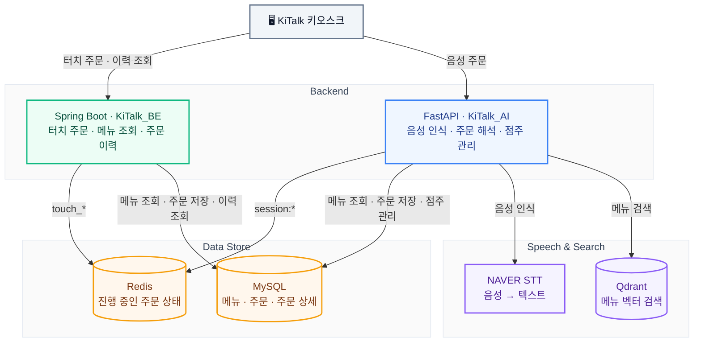

# KiTalk Backend

> 고령층의 키오스크 이용을 돕는 **음성 인식 키오스크, KiTalk**의 Spring Boot 백엔드.
> FastAPI 기반 음성 주문 서버와 함께 서비스를 구성하며,
> **터치 주문·메뉴 조회·전화번호별 주문 이력**을 담당합니다.

KiTalk은 **음성으로 말하는 주문**과 **화면을 누르는 주문**을 지원합니다.
[KiTalk_AI](https://github.com/chaeelin/KiTalk_AI)는 음성 인식과 주문 해석을,
이 레포지토리는 터치 장바구니와 주문 확정, 최근 주문·자주 주문한 메뉴 조회를 처리합니다.
두 서버 모두 Redis에 진행 중인 상태를 관리하고 MySQL에 확정 주문을 저장하는 구조입니다.

<br>

## 무엇을 푸는 프로젝트인가

키오스크 사용이 익숙하지 않은 고령층에게는 메뉴를 찾고 옵션을 선택하는 과정도 장벽이 될 수 있습니다.
KiTalk은 음성 인터페이스와 터치 UI로 주문할 수 있도록 구성한 서비스입니다.

```text
음성 주문: “아이스 아메리카노 두 잔 포장해주세요”
           → 음성 인식 → 메뉴·온도·수량·포장 방식 해석

터치 주문: 메뉴 선택 → 수량 변경 → 포장 방식 선택
```

입력 방식이 달라도 백엔드는 주문 도중 바뀌는 선택을 관리하고,
최종 주문을 저장해야 합니다. 이 레포지토리는 그중 **터치 주문 경로와 주문 이력 조회**를 담당합니다.

음료를 주문하는 과정은 메뉴 하나를 고르는 것으로 끝나지 않습니다.

```text
메뉴 선택 → 수량 변경 → 다른 메뉴 추가 → 포장 방식 선택 → 주문 확정
```

이 과정에서 백엔드는 **계속 바뀌는 선택 상태**를 유지해야 합니다.
사용자가 중간에 주문을 그만둘 수도 있고, 같은 메뉴를 여러 번 추가할 수도 있습니다.
반면 확정된 주문은 나중에 다시 조회할 수 있도록 남아 있어야 합니다.

KiTalk BE는 이 두 종류의 데이터를 나누어 다룹니다.

| 데이터 | 특성 | 저장 방식 |
|---|---|---|
| **주문 중인 상태** | 수량·메뉴·포장 방식이 바뀌고, 중간에 이탈할 수 있음 | Redis에 세션별 저장, TTL 적용 |
| **확정된 주문** | 주문 내역과 당시 가격을 보존해야 함 | MySQL에 주문과 상세 항목 저장 |
| **개인별 주문 이력** | 다음 주문에서 이전 선택을 참고할 수 있어야 함 | 전화번호별 최근 5건·자주 주문한 메뉴 TOP 3 조회 |

이 README는 **임시 상태를 확정 주문으로 전환하는 과정과, 그 데이터를 다시 활용하는 방식**을 중심으로 설명합니다.

<br>

## 아키텍처



> 서버별 역할을 나타낸 논리 아키텍처입니다. Redis의 주문 상태는 키로 구분하며, 두 서버가 동일한 MySQL에 연결되면 음성·터치 주문을 함께 조회할 수 있습니다.

위 그림은 두 저장소의 코드에 나타난 역할과 데이터 구조를 기준으로 정리했습니다.
동일한 MySQL DB를 연결하면 두 주문 경로의 결과를 같은 주문 이력으로 조회할 수 있습니다.
실제 배포 환경의 DB 연결 대상과 프론트엔드 호출 순서는 별도 설정에 따라 결정됩니다.

Spring Boot의 메뉴·주문 이력 조회에는 **Spring Data JPA**를 사용하고,
주문 확정 경로에서는 **JDBC로 트랜잭션을 직접 제어**합니다.
Redis에는 장바구니의 메뉴 ID와 수량을 저장하고, 응답 구성과 주문 확정 시
MySQL의 메뉴 정보로 이름·가격·온도·이미지를 채웁니다.

<br>

## FastAPI와 어떻게 연결되는가

두 서버의 접점은 **메뉴와 주문 데이터 모델**입니다.
현재 코드에서 Spring Boot → FastAPI 또는 FastAPI → Spring Boot로 직접 주문 API를 호출하는 로직은 확인되지 않습니다.
Spring Boot에는 `RestTemplate` Bean이 있지만, 이를 사용하는 AI 호출부는 없습니다.

| 역할 | Spring Boot · 이 레포지토리 | FastAPI · KiTalk_AI |
|---|---|---|
| 입력 처리 | 메뉴 ID·수량 기반 터치 주문 | NAVER STT 음성 인식, 텍스트 주문 해석 |
| 메뉴 처리 | 활성 메뉴·카테고리 조회 | 임베딩·Qdrant 기반 메뉴 검색, 온도·수량·포장 해석 |
| 진행 중 상태 | `touch_cart:*`, `touch_packaging:*`, `touch_phone:*` | `session:*`에 단계와 주문 데이터 저장 |
| 주문 확정 | JDBC로 `orders`·`order_items` 저장 | PyMySQL로 `orders`·`order_items` 저장 |
| 이력·관리 | 전화번호별 최근 5건·자주 주문한 메뉴 TOP 3 | 점주 로그인, 메뉴 등록, 주문 조회·상태 변경 |

예를 들어 음성 주문을 FastAPI에서 확정하면 `services/phone_service.py`가
`orders`와 `order_items`에 주문을 저장합니다.
Spring Boot의 `PhoneOrderService`는 같은 구조의 테이블을 전화번호로 조회합니다.
**같은 DB를 사용하고 전화번호가 저장되어 있다면, 음성으로 주문한 내역도 이력 조회 대상이 됩니다.**

Redis를 사용한다는 점은 같지만, 실제 주문 상태의 키와 데이터 구조는 다릅니다.
Spring Boot에 `session:*`을 다루는 `SessionService`도 있으나,
현재 터치 주문 컨트롤러는 `touch_*` 경로를 사용합니다.
따라서 **음성 주문과 터치 주문 사이의 장바구니 자동 동기화**까지 구현된 것으로 설명하지는 않습니다.

<details>
<summary><b>FastAPI의 주요 처리 경로와 코드</b></summary>

아래 경로는 FastAPI 라우터 선언 기준입니다.

| 처리 | 경로 | 관련 코드 |
|---|---|---|
| 음성 파일을 텍스트로 변환 | `POST /stt` | `routers/stt.py`, `services/naver_stt_service.py` |
| 단계별 주문 세션 시작 | `POST /logic/start` | `routers/logic_router.py` |
| 메뉴·수량 해석 | `POST /logic/order/{session_id}` | `services/logic_service.py` |
| 한 번에 말한 주문 처리 | `POST /order-at-once/process/{session_id}` | `services/order_at_once_service.py` |
| 전화번호 입력·주문 확정 | `POST /api/phone/input/{session_id}` | `services/phone_service.py` |

음성 인식 API는 텍스트를 반환하고, 주문 해석 API는 별도로 노출됩니다.
상세 구현은 [KiTalk_AI 저장소](https://github.com/chaeelin/KiTalk_AI)를 참고할 수 있습니다.

</details>

<br>

## 핵심 로직: 장바구니를 확정 주문으로 바꾸기

`touch/service/CartService.java` · `touch/service/PhoneService.java`

### 1. 세션별 임시 상태와 만료 시간

장바구니, 포장 방식, 전화번호를 같은 `sessionId` 아래 서로 다른 키로 관리합니다.

| Redis 키 | 저장 내용 | TTL |
|---|---|---|
| `touch_cart:{sessionId}` | 메뉴 ID·수량, 생성·수정 시각 | 저장 시점부터 2시간 |
| `touch_packaging:{sessionId}` | 포장 방식, 수정 시각 | 저장 시점부터 2시간 |
| `touch_phone:{sessionId}` | 전화번호, 수정 시각 | 저장 시점부터 2시간 |
| `touch_session_completed:{sessionId}` | 완료된 주문 ID·완료 시각 | 5분 |

임시 데이터는 TTL로 정리되므로, 사용자가 주문 도중 이탈해도 계속 남지 않습니다.
각 키의 만료 시간은 독립적이며, 장바구니를 수정한다고 전화번호나 포장 방식의 TTL까지 갱신되지는 않습니다.

### 2. ‘추가’와 ‘전체 수정’의 의미를 구분

동일한 메뉴를 추가하면 기존 수량에 더합니다. 전체 수정 요청은
**요청에 담긴 목록을 최종 장바구니 상태로 반영**합니다.

```text
기존 장바구니: 아메리카노 2개, 라테 1개

추가 요청: 아메리카노 1개
→ 아메리카노 3개, 라테 1개

전체 수정 요청: 아메리카노 1개
→ 아메리카노 1개 (요청에 없는 라테는 제거)
```

전체 수정에서 수량 `0`은 삭제를 의미하고, 음수는 검증 단계에서 거절합니다.
빈 목록으로 전체 수정하는 요청은 허용하지 않으며, 전체 비우기는 별도 API로 처리합니다.

### 3. 주문과 상세 항목을 하나의 트랜잭션으로 저장

주문 확정은 다음 순서로 처리합니다.

```text
장바구니 키 존재 확인 + 완료 여부 확인
                  ↓
장바구니·메뉴 정보·포장 방식 조회
                  ↓
MySQL 트랜잭션 시작
  ├─ orders INSERT → 생성된 주문 ID 확보
  └─ order_items 일괄 INSERT → executeBatch()
                  ↓
COMMIT → Redis에 완료 표시 (5분)
```

주문 헤더만 저장되고 상세 항목이 빠지는 상황을 막기 위해,
두 INSERT를 **같은 DB 연결의 트랜잭션**으로 묶고 실패하면 롤백합니다.

`order_items`에는 메뉴 ID뿐 아니라 **주문 시점의 메뉴명·가격·수량·온도**도 저장합니다.
이후 메뉴 정보가 바뀌더라도 과거 주문의 이름과 가격을 현재 메뉴 값으로 덮어 읽지 않도록 한 구조입니다.
이미지는 현재 메뉴의 `profile`을 조회해 붙입니다.

> MySQL 저장과 Redis 완료 표시는 별도 작업입니다.
> 완료 키는 짧은 시간 내 재요청을 확인하는 장치이며, 동시 요청까지 막는 원자적 멱등성 보장은 아닙니다.

<br>

## 주문 이력을 다시 활용하는 방식

`phone/service/PhoneOrderService.java` · `touch/repository/OrderItemsRepository.java`

### 최근 주문 5건

전화번호로 주문을 조회하고 **생성 시각 내림차순 → 주문 ID 내림차순**으로 정렬합니다.
같은 시각에 생성된 주문도 ID로 순서가 결정됩니다.

최근 주문 ID들을 모아 `IN` 쿼리로 상세 항목을 조회한 뒤, 주문 ID별로 그룹화해 응답을 구성합니다.
다만 메뉴 이미지는 상세 항목마다 개별 조회하므로, 이 부분은 추가 최적화 대상입니다.

### 자주 주문한 메뉴 TOP 3

기준은 **총 구매 수량이 아니라, 해당 메뉴가 포함된 서로 다른 주문의 개수**입니다.

```sql
COUNT(DISTINCT oi.order_id) AS orderCount
```

예를 들어 아메리카노를 한 번에 5잔 주문하면 `1회`,
라테를 서로 다른 주문에서 한 잔씩 3번 주문하면 `3회`로 집계합니다.
이 기준에서는 라테가 더 위에 나옵니다.

| 항목 | 구현 기준 |
|---|---|
| 조회 범위 | 전달받은 전화번호의 주문 이력 |
| 그룹 기준 | 메뉴 ID·메뉴명·온도 |
| 정렬 | 주문 횟수 내림차순, 메뉴 ID 오름차순 |
| 반환 개수 | 최대 3개 |
| 이미지 조회 | TOP 3의 메뉴 ID를 모아 `findAllById`로 일괄 조회 |

<br>

## 주문 흐름에서 구분한 부분

### 전화번호 입력은 선택, 기존 번호는 재사용

전화번호를 입력하지 않아도 주문을 완료할 수 있습니다.
입력한 경우에는 번호를 정규화해 저장하고, 이후 주문 이력 조회에 활용합니다.

| 흐름 | 동작 |
|---|---|
| 번호 입력 건너뛰기 | `/choice`에 `wants_phone=false` → 주문 확정 |
| 번호 입력 후 바로 완료 | `/input` → 번호 저장 후 주문 확정 |
| 번호를 먼저 저장 | `/phone_number` → Redis에 번호만 저장 |
| 저장된 번호로 완료 | `/complete` → 기존 번호를 읽어 주문 확정 |

`/complete`는 **번호를 다시 입력하지 않는 경로**이며, 저장된 전화번호는 필요합니다.
전화번호 없이 완료하는 경로와 구분됩니다.

### 가격은 서버의 메뉴 데이터로 계산

장바구니 추가 요청은 메뉴 ID와 수량을 전달합니다.
가격은 서버가 메뉴 데이터에서 읽어 **단가 × 수량**으로 계산합니다.
메뉴의 활성 상태, 수량, 포장 방식 등은 별도의 Validator에서 검증합니다.

### 메뉴 변경 이력은 Flyway로 관리

`src/main/resources/db/migration`에 V1~V9 스크립트가 있습니다.
메뉴 테이블 생성, 초기 데이터, 인기 메뉴 여부, 이미지 정보 등의 변경을 버전으로 남깁니다.
설정 예제는 `ddl-auto=none`으로 JPA의 자동 테이블 생성을 끄고 Flyway를 사용합니다.

<br>

## API

아래 경로는 컨트롤러 매핑 기준입니다. 별도 context path를 설정했다면 앞에 붙습니다.

| Method | Path | 설명 |
|---|---|---|
| `GET` | `/api/menu/list` | 메뉴 조회, `category` 선택 가능 |
| `GET` | `/api/menu/categories` | 카테고리 목록·메뉴 수 조회 |
| `POST` | `/api/touch/cart/{sessionId}/add` | 메뉴 추가·동일 메뉴 수량 합산 |
| `PUT` | `/api/touch/cart/{sessionId}/update` | 장바구니 전체 상태 반영 |
| `GET` | `/api/touch/cart/{sessionId}` | 장바구니·총액·포장 방식 조회 |
| `DELETE` | `/api/touch/cart/{sessionId}/remove` | 특정 메뉴 삭제 |
| `DELETE` | `/api/touch/cart/{sessionId}/clear` | 장바구니 비우기 |
| `POST` | `/api/touch/cart/{sessionId}/packaging` | 포장·매장 이용 방식 설정 |
| `POST` | `/api/touch/phone/{sessionId}/choice` | 전화번호 입력 여부 선택 |
| `POST` | `/api/touch/phone/{sessionId}/input` | 전화번호 저장 후 주문 확정 |
| `POST` | `/api/touch/phone/{sessionId}/phone_number` | 전화번호만 저장 |
| `POST` | `/api/touch/phone/{sessionId}/complete` | 기존 전화번호로 주문 확정 |
| `GET` | `/api/phone/orders?phone=...` | 최근 주문 최대 5건 |
| `GET` | `/api/phone/top-menus?phone=...` | 자주 주문한 메뉴 최대 3개 |

메뉴·주문 이력 API는 `BaseResponse<T>`를 사용합니다.
장바구니·주문 확정 API는 결과 필드를 직접 반환하므로, 모든 API의 응답 구조가 동일하지는 않습니다.
상세 요청 스키마는 서버 실행 후 Swagger UI(`/swagger-ui/index.html`)에서 확인할 수 있습니다.

<details>
<summary><b>요청 예시 — 장바구니 추가와 전체 수정</b></summary>

메뉴 추가 (`POST /api/touch/cart/{sessionId}/add`):

```json
{
  "menuId": 1,
  "quantity": 2
}
```

전체 수정 (`PUT /api/touch/cart/{sessionId}/update`):

```json
{
  "orders": [
    { "menu_id": 1, "quantity": 1 },
    { "menu_id": 2, "quantity": 0 }
  ]
}
```

메뉴 ID는 실제 DB에 존재하는 활성 메뉴로 지정해야 합니다.
추가 요청의 `menuId`와 전체 수정 요청의 `menu_id`는 현재 DTO 정의에 따른 이름입니다.

</details>

<br>

## 한계와 다음 스텝

- **두 주문 경로의 공통 규칙 관리.** Spring Boot와 FastAPI가 각각 주문을 저장하므로, 가격 계산·전화번호 정규화·주문 스키마 변경 시 두 구현의 일관성을 검증해야 합니다. 공통 계약 테스트와 주문 저장 책임의 통합을 검토할 수 있습니다.
- **주문 확정의 멱등성 강화.** 완료 키 확인과 DB 저장 사이에 동시 요청이 들어오면 중복 저장될 수 있습니다. 완료 키도 5분 후 만료됩니다. DB의 고유한 주문 요청 키와 재요청 시 기존 결과를 반환하는 처리가 필요합니다.
- **주문 확정 시 메뉴 조회 실패 처리.** 현재 `CartUtils`는 조회에 실패한 항목을 결과에서 제외하거나 금액 계산에서 건너뜁니다. 확정 경로에서는 일부 항목이 빠진 주문을 저장하지 않도록 전체 실패로 처리할 필요가 있습니다.
- **주문 이력 접근 제어.** 현재 보안 설정은 `permitAll`이며 전화번호로 이력을 조회합니다. 실제 서비스에서는 번호 소유 확인과 조회 권한 검증이 필요합니다.
- **조회와 응답 구조 정리.** 최근 주문의 이미지 개별 조회를 일괄 조회로 바꾸고, API별 응답 형식과 필드 명명 규칙을 통일할 수 있습니다.
- **DB 초기화 재현성.** 현재 마이그레이션에는 `orders`·`order_items` 생성 스크립트가 없고, V8은 기존 `orders` 테이블을 변경합니다. 빈 DB에서 시작하려면 주문 테이블 초기 스키마를 보완해야 합니다.
- **핵심 로직 테스트 추가.** 현재 테스트는 Spring 컨텍스트 로딩 테스트 1개입니다. 수량 합산·전체 수정·주문 롤백·동시 확정·TOP 3 집계 기준을 검증하는 테스트가 다음 단계입니다.

<br>

## 기술 스택

| 분류 | 사용 기술 |
|---|---|
| **Language / Build** | Java 17, Gradle Wrapper |
| **Framework** | Spring Boot 3.5.4, Spring Web |
| **Persistence** | Spring Data JPA, JDBC, MySQL |
| **Temporary Store** | Spring Data Redis, Redis |
| **Migration** | Flyway Core / MySQL |
| **API Docs** | springdoc-openapi 2.8.1, Swagger UI |
| **Security 구성** | Spring Security, JJWT 0.11.5 — 현재 API 인증 강제는 미적용 |
| **Test** | Spring Boot Test, JUnit Platform |

함께 서비스를 구성하는 AI 서버는 **FastAPI, NAVER STT, sentence-transformers, Qdrant, Redis, PyMySQL**을 사용합니다.
AI 구현은 [KiTalk_AI](https://github.com/chaeelin/KiTalk_AI)에 분리되어 있습니다.

<br>
